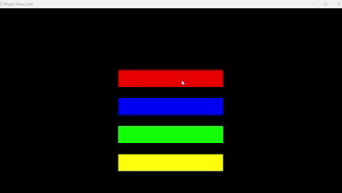
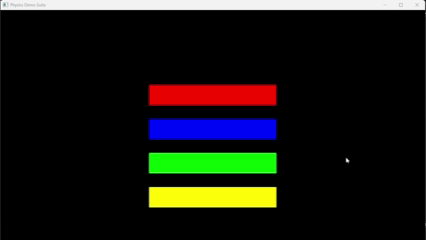
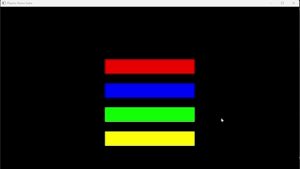
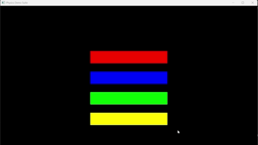

# ⚛️ OpenGL Physics Demo Suite






A collection of interactive 3D physics simulations built in **C++** using **OpenGL**, **GLFW**, and **GLAD**.  
Explore particle collisions, momentum conservation, Newton's cradle, and aerodynamic flow visualization.

---

## 🎮 Controls

| Action | Key / Mouse |
|:-------|:-------------|
| Select demo | Click colored buttons |
| Interact with simulation | Click on objects |
| Adjust parameters | Click parameter buttons |
| Exit | `Esc` |

---

## 🧪 Demos

### 🔴 Particle Collisions
Red particles floating inside a rectangular container, bouncing off walls and colliding with each other in real-time.

**Controls:**
- `5` / `10` / `50` buttons – Change the number of particles

### 🔵 Momentum Conservation
Two blue squares moving horizontally inside a container, demonstrating elastic collisions and momentum transfer.

**Controls:**
- Mass buttons – Adjust the second square's mass:
  - Same mass
  - 2X mass
  - 10X mass

### 🟢 Newton's Cradle
Classic Newton's cradle simulation with interactive ball dropping.

**Controls:**
- Click balls 1-5 to drop them from height
- Clicking ball 1: Drops first ball
- Clicking ball 2: Drops first and second balls
- Clicking ball 3: Drops first, second, and third balls
- `Reset` button – Reset the cradle to starting position

### 🟡 Wind Tunnel
Air particle flow visualization around an adjustable aerofoil, demonstrating aerodynamic principles.

**Controls:**
- Shape buttons – Change the aerofoil profile

---

## ⚙️ Features

- Four distinct physics simulations in one program
- Interactive start screen with colored demo buttons
- Real-time collision detection and response
- Elastic collision physics with momentum conservation
- Particle system rendering
- Adjustable simulation parameters
- Built with **CMake**, **GLFW**, and **GLAD**

---

## 🛠️ Build Instructions
```bash
git clone https://github.com/yourusername/opengl-physics-demo.git
cd opengl-physics-demo
cmake -S . -B build
cmake --build build
./build/PhysicsDemo.exe
```

---

## 📂 Project Structure
```
include/       → headers (GLFW, GLAD, etc.)
lib/           → glfw3.lib
src/           → main.cpp, glad.c
glfw3.dll      → runtime dependency
CMakeLists.txt
README.md
```

---

## 🔬 About

Built by Jono Godden as an exploration of physics simulation and OpenGL graphics programming.

Click through the colored buttons to explore different physics demonstrations — from particle collisions to fluid dynamics!

---

## License

This project is open-source and available under the MIT License.